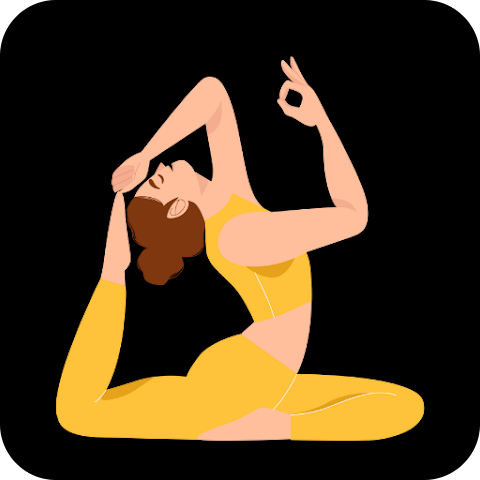

 

  
  

    Explore a world of innovation and creativity as we present our finest selection of cutting-edge mobile applications. Each app is meticulously crafted to deliver a seamless and engaging user experience, tailored to meet diverse needs and preferences.
  

<h1>Portfolio</h1>
  

    
     
    <a href="https://play.google.com/store/apps/details?id=health.yoga.mudras"><strong>Mudras : Yoga Book</strong> </a>
  Mudras are hand gestures that enhance the flow of energy during yoga and meditation. They pass energy throughout the body and are influenced by diet and lifestyle. Daily practice with proper pressure, touch, sitting position, and breathing for 5 to 45 minutes is recommended. The Mudras app provides guidance for practicing hand mudras anytime, anywhere. Elevate your wellbeing and achieve optimal energy flow with Mudras.
     
    
     
     
    
     
    <a href="https://play.google.com/store/apps/details?id=yogaworkouts.loseweight.dailyyoga.mudras.yogaapp"><strong>Daily Yoga | Meditation App</strong> </a>
  Welcome to The Daily Yoga app it is the best app for anyone of any age group who wants to start or improve there yoga practice. Whether you seek stress relief or a mindful workout, our app has you covered. Embrace a healthier lifestyle today – download The Daily Yoga app and embark on a transformative journey of self-discovery!
     
    
     
     
    
     
    <a href="https://play.google.com/store/apps/details?id=yoga.meditation.sounds.meditationmusic.yogamusic.music"><strong>Meditation Music</strong> </a>
  Immerse yourself in a blissful meditation experience with our free and ad-free meditation music app. Find serenity and calmness as you explore a vast library of soothing tracks carefully curated to enhance your mindfulness practice. Discover tranquility, relieve stress, and achieve inner peace with our collection of meditative melodies. Download now and embark on a journey of relaxation and self-discovery.
     
    
     
     
    
     
    <a href="https://play.google.com/store/apps/details?id=com.chalisa.aarati.bhajan"><strong>Chalisa Aarti & Vrat katha</strong> </a>
  According to Hinduism, each day is important. In today's world every person is moving very fast and have very less time for mental peace. These Pooja practices will help in dropping your stress and anxiety, and discover a lasting calm that comes from within, in just a few minutes a day.
     
    
  

