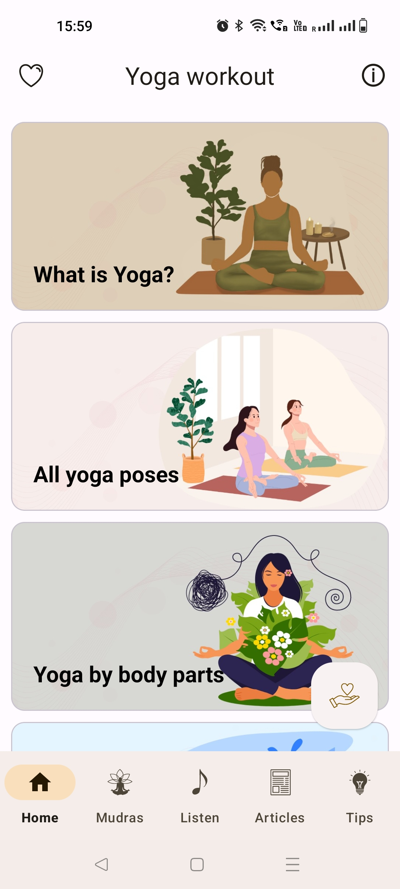
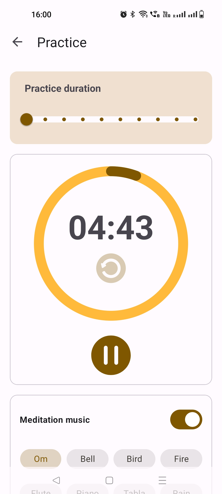

  

  <h3 align="center">ReadME Generator</h3>

  

    An Awesome ReadME Generator To Jumpstart Your Projects!
     
    Note This Project Is Still W.I.P
     
     
    <a href="https://readme.shaankhan.dev"><strong>View Demo »</strong></a>
     
     
  

## Screenshots

