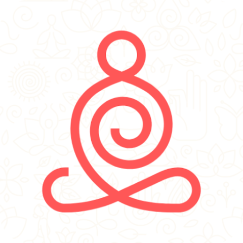

  
  

    Explore a world of innovation and creativity as we present our finest selection of cutting-edge mobile applications. Each app is meticulously crafted to deliver a seamless and engaging user experience, tailored to meet diverse needs and preferences.
  

<h1>Portfolio</h1>
  

    
     
    <a href="https://play.google.com/store/apps/details?id=health.yoga.mudras"><strong>Mudras : Yoga Book</strong> </a>
  Mudras are hand gestures that enhance the flow of energy during yoga and meditation. They pass energy throughout the body and are influenced by diet and lifestyle. Daily practice with proper pressure, touch, sitting position, and breathing for 5 to 45 minutes is recommended. The Mudras app provides guidance for practicing hand mudras anytime, anywhere. Elevate your wellbeing and achieve optimal energy flow with Mudras.
     
    
     
     
    
     
    <a href="https://play.google.com/store/apps/details?id=yogaworkouts.loseweight.dailyyoga.mudras.yogaapp"><strong>Daily Yoga | Meditation App</strong> </a>
  Welcome to The Daily Yoga app it is the best app for anyone of any age group who wants to start or improve there yoga practice. Whether you seek stress relief or a mindful workout, our app has you covered. Embrace a healthier lifestyle today – download The Daily Yoga app and embark on a transformative journey of self-discovery!
     
    
     
     
    
     
    <a href="https://play.google.com/store/apps/details?id=yoga.meditation.sounds.meditationmusic.yogamusic.music"><strong>Meditation Music</strong> </a>
  Immerse yourself in a blissful meditation experience with our free and ad-free meditation music app. Find serenity and calmness as you explore a vast library of soothing tracks carefully curated to enhance your mindfulness practice. Discover tranquility, relieve stress, and achieve inner peace with our collection of meditative melodies. Download now and embark on a journey of relaxation and self-discovery.
     
    
     
     
    
     
    <a href="https://play.google.com/store/apps/details?id=pranayama.yoga.breathingexercises"><strong>Pranayama : Breathing Exercise</strong> </a>
  Unlock the power of breathing exercises with pranayama. Pranayama is an ancient practice rooted in Indian tradition, harnessing the power of breath control to enhance physical, mental, and spiritual well-being. Originating from the Vedic texts over 5,000 years ago, it plays a vital role in yoga, promoting holistic health and vitality. It is also approved by modern science.
     
    
  

