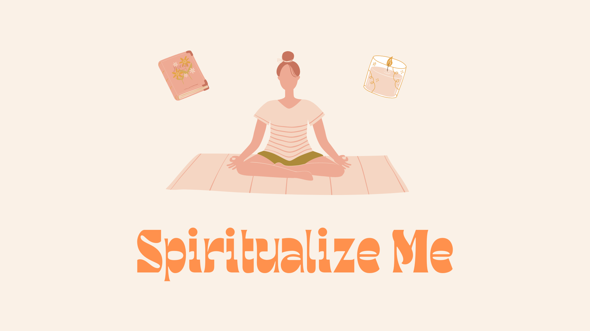

 

  
  

    Explore a world of innovation and creativity as we present our finest selection of cutting-edge mobile applications. Each app is meticulously crafted to deliver a seamless and engaging user experience, tailored to meet diverse needs and preferences.
  

<h1>Portfolio</h1>
  

    
     
    <a href="https://play.google.com/store/apps/details?id=health.yoga.mudras"><strong>Mudras : Yoga Book</strong> </a>
  Mudras are hand gestures that enhance the flow of energy during yoga and meditation. They pass energy throughout the body and are influenced by diet and lifestyle. Daily practice with proper pressure, touch, sitting position, and breathing for 5 to 45 minutes is recommended. The Mudras app provides guidance for practicing hand mudras anytime, anywhere. Elevate your wellbeing and achieve optimal energy flow with Mudras.
     
    
     
     
    
     
    <a href="https://play.google.com/store/apps/details?id=health.yoga.mudras"><strong>Mudras : Yoga Book</strong> </a>
  Mudras are hand gestures that enhance the flow of energy during yoga and meditation. They pass energy throughout the body and are influenced by diet and lifestyle. Daily practice with proper pressure, touch, sitting position, and breathing for 5 to 45 minutes is recommended. The Mudras app provides guidance for practicing hand mudras anytime, anywhere. Elevate your wellbeing and achieve optimal energy flow with Mudras.
     
    
     
     
    
     
    <a href="https://play.google.com/store/apps/details?id=health.yoga.mudras"><strong>Mudras : Yoga Book</strong> </a>
  Mudras are hand gestures that enhance the flow of energy during yoga and meditation. They pass energy throughout the body and are influenced by diet and lifestyle. Daily practice with proper pressure, touch, sitting position, and breathing for 5 to 45 minutes is recommended. The Mudras app provides guidance for practicing hand mudras anytime, anywhere. Elevate your wellbeing and achieve optimal energy flow with Mudras.
     
    
     
     
    
     
    <a href="https://play.google.com/store/apps/details?id=health.yoga.mudras"><strong>Mudras : Yoga Book</strong> </a>
  Mudras are hand gestures that enhance the flow of energy during yoga and meditation. They pass energy throughout the body and are influenced by diet and lifestyle. Daily practice with proper pressure, touch, sitting position, and breathing for 5 to 45 minutes is recommended. The Mudras app provides guidance for practicing hand mudras anytime, anywhere. Elevate your wellbeing and achieve optimal energy flow with Mudras.
     
    
  

  

